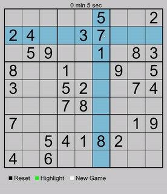

# About
Hello, this is my first project by my self in python. It's very basic idea of sudoku created with pygame. It include highlighting row and column with a current position of your mouse (you can turon of highlight).
