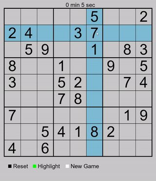
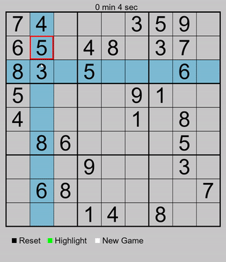
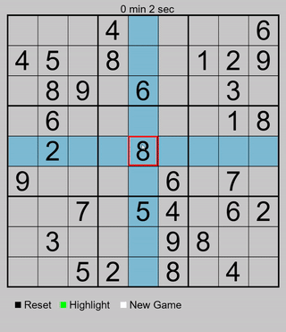

# WORK IN PROGRESS
# General info
Hello, this is my first project by my self in python. It's very basic idea of sudoku created with pygame. It include highlighting row and column with a current position of your mouse (you can turn that off).
# :fire: Presentation
## Highlight
Wherever your cursor is pointing, row and column will be highlighted. You can all so disable this future, by clicking in green rectangle.

## Lost the game
After 3 missed numbers, the next one will result in a loss.

## Reset board
If you don't put up with mistakes, there is tiny black rectangle with label "Reset". One click and boom, no one saw your mistake.

